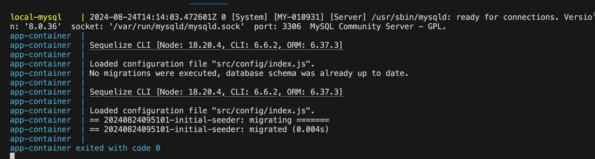
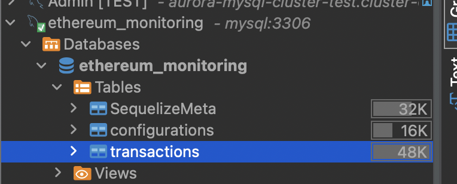
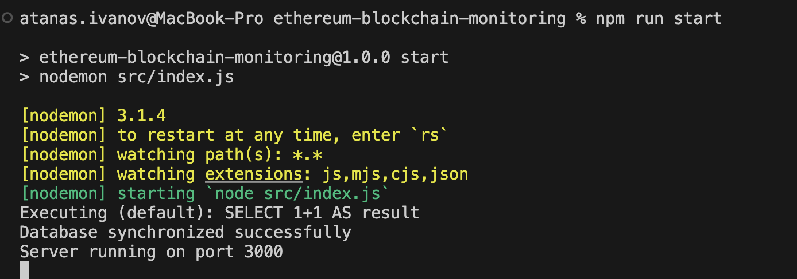

# Ethereum Blockchain Monitoring

A Node.js Server for Monitoring the Ethereum Blockchain and make the right decision based on a given rule set.

Includes a Ruling System that will monitor and watch all Ethereum transaction that will store and filter data based on predefined dynamic configuration.

## Project Setup

1. Clone the github repo locally using

```
git clone https://github.com/atanasivanovv/ethereum-blockchain-monitoring.git
```

2. Run `npm install` to install the related dependencies

3. Create a `.env` file in the root directory of the project and create the following Environment Variables:

   - **`INFURA_API_KEY`**: The API key for accessing the Infura Ethereum node service.
   - **`DB_NAME`**: The name of the database to connect to.
   - **`DB_USER`**: The username for the database connection.
   - **`DB_PASSWORD`**: The password for the database connection.
   - **`DB_ROOT_PASSWORD`**: The root password for the database.
   - **`DB_HOST`**: The host address of the database server.
   - **`DB_PORT`**: The port number on which the database server is running.
   - **`NODE_ENV`**: The environment in which the Node.js application is running (e.g., development, production).
   - **`API_ENV`**: The environment for the API (e.g., development, production).
   - **`API_PORT`**: The port number on which the API server will run.
   - **`API_VERSION`**: The version of the API.
   - **`API_PORT`**: The port number on which the Node.js server will run.

4. Make sure you have `Docker` installed on your machine
5. To setup the database locally you should:
   - Build the Docker Image: Run the following command to build the Docker image for the database `docker-compose build`

    - Start the Docker Container: Run the following command to start the Docker container for the database `docker-compose up`

    You should end up in a state like so: 
    
   **IMPORTANT:** Leave this terminal open to have an open database connection!

6. If you have a Database Client like DBeaver, you can open a connection to the DB locally so you can see the data, play around with it and so on. Use the username, password as well as the database host and port in order to connect from you local client. 

    

7. After successfully running the database locally you can start the Node.js server itself. In order to do that, execute:

    ```
    npm run start
    ```

    If everything has gone correctly you will have the server running at port `3000`.

    

